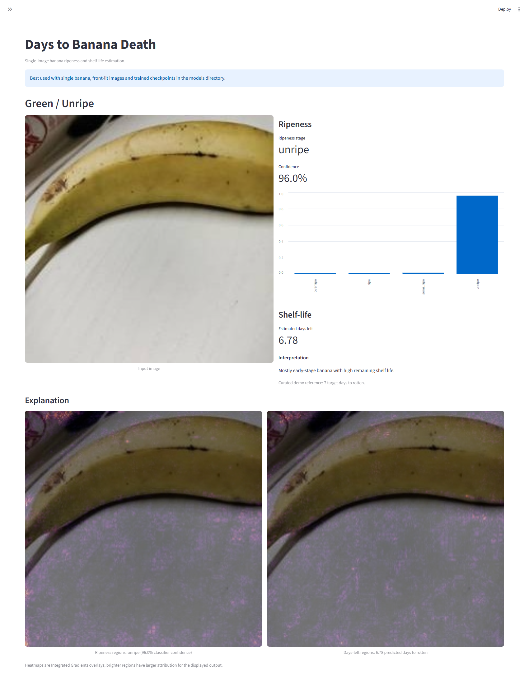
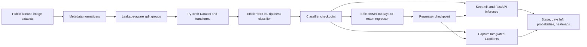
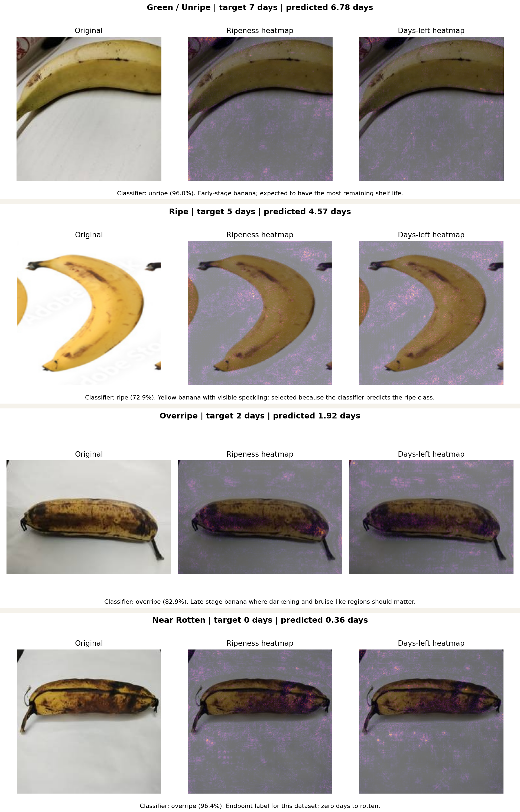

# banana-shelf-life-predictor

**Days to Banana Death**

Estimate how long a banana has left before it reaches the rotten stage from a single photo. The project is intentionally built in two stages:

1. V1: ripeness-stage classification
2. V2: days-to-rotten regression

That order matters. Public banana datasets are easier to find for ripeness classes than exact shelf-life labels, so the classifier is the fastest way to validate the data pipeline, transfer learning setup, explainability flow, app, and deployment.



## Headline Metrics

| model | dataset | primary metric | supporting metrics |
| --- | --- | ---: | --- |
| V1 EfficientNet-B0 classifier | BananaImageBD 4-stage ripeness images | `97.56%` accuracy | macro F1 `97.27%` |
| V2 EfficientNet-B0 regressor | Day0-to-Day7 banana sequences | `1.57` day MAE | RMSE `1.96`, within 1 day `35.00%`, within 2 days `68.75%` |

The regressor beats a train-mean baseline on the duplicate-safe held-out split: baseline MAE `2.00` days, baseline within 2 days `50.00%`.

## Architecture



## Demo Assets

Pinned demo banana images are committed under `reports/demo/` so the README and app can show the product without bundling the full datasets.

| green / unripe | ripe | overripe | near rotten |
| --- | --- | --- | --- |
|  |  |  |  |

Explainability grid:



## Quick Start

```powershell
python -m venv .venv
.venv\Scripts\Activate.ps1
pip install -r requirements.txt
pytest
streamlit run app/streamlit_app.py
```

For a CLI smoke test using a pinned demo image:

```powershell
python -m src.predict --image reports/demo/green_unripe_original.jpg
```

Default trained checkpoints are included at `models/classifier_best.pt` and `models/regressor_best.pt`. Raw public datasets are not bundled; use the data download commands below to reproduce training.

## Target Definition

For the first serious version of the project, the target is:

`days_to_rotten = number of days until the banana reaches the rotten stage`

This is narrower and more reproducible than "inedible" or "unsellable". The repo is scaffolded around that definition.

## Product Features

- Upload a banana image and predict ripeness stage
- Estimate days left until the banana reaches the rotten stage
- Visualize model attention with Captum attributions
- Serve the model through Streamlit and FastAPI
- Keep training, evaluation, tests, Docker, and reports in one clean repo

## Dataset Strategy

Planned data sources:

- Primary regression source: a day-by-day banana dataset with banana-level trajectories across consecutive days
- Secondary classification source: a larger ripeness-classification dataset for fast V1 validation and optional warm-up

Verified Phase 2 sources as of 2026-04-24:

- `mendeley_bananaimagebd_2024`: [BananaImageBD](https://data.mendeley.com/datasets/ptfscwtnyz/2), used for the V1 classifier baseline
- `mendeley_banana_day0_day7_2026`: [banana_ripening_dataset_day0_to_day7](https://data.mendeley.com/datasets/d5tczj7fs7/1), used for the V2 days-to-rotten regression baseline
- `mendeley_ripen_banana_2025`: [Ripen Banana Dataset](https://data.mendeley.com/datasets/j9sp322drp/1)
- `mendeley_prata_catarina_2023`: [Dataset of Banana Prata Catarina Images Labeled in Eight Ripeness Stages](https://data.mendeley.com/datasets/7vb4djkbrc/1)
- `hf_banana_images_reference_csv`: [Banana Images Dataset reference CSV](https://huggingface.co/datasets/Saeraj/Banana_Images_Dataset)
- `github_bananaripeness`: [luischuquim/BananaRipeness](https://github.com/luischuquim/BananaRipeness)

Before training, convert every source into a single metadata CSV with these columns:

| column | description |
| --- | --- |
| `image_path` | relative or absolute path to the image |
| `banana_id` | unique banana identifier |
| `day_index` | day number within the sequence |
| `days_to_rotten` | regression target |
| `ripeness_stage` | stage label for classification |
| `source_dataset` | source name for traceability |
| `split_group` | grouping key used to prevent leakage |
| `notes` | optional free-text notes |

Important rule: split by `banana_id` or another banana-level `split_group`, never by raw image row, otherwise time-series leakage will make metrics look falsely strong.

## Repo Layout

```text
banana-shelf-life-predictor/
├─ app/
│  ├─ fastapi_app.py
│  └─ streamlit_app.py
├─ data/
│  ├─ interim/
│  ├─ metadata/
│  ├─ processed/
│  └─ raw/
├─ models/
├─ notebooks/
├─ reports/
│  ├─ figures/
│  └─ metrics/
├─ src/
│  ├─ analyze_regressor.py
│  ├─ config.py
│  ├─ datasets.py
│  ├─ evaluate.py
│  ├─ explain.py
│  ├─ models.py
│  ├─ predict.py
│  ├─ train_classifier.py
│  ├─ train_regressor.py
│  ├─ training.py
│  └─ transforms.py
├─ tests/
├─ .github/
├─ Dockerfile
├─ requirements.txt
└─ README.md
```

## Full Reproduction Commands

Create the environment and install dependencies:

```powershell
python -m venv .venv
.venv\Scripts\Activate.ps1
pip install -r requirements.txt
```

Run tests:

```powershell
pytest
```

List the verified external data sources:

```powershell
python -m src.download_data --list-sources
```

Fetch a live manifest for the natural-ripening Mendeley source:

```powershell
python -m src.download_data `
  --source mendeley_ripen_banana_2025 `
  --manifest-out data/metadata/external/mendeley_ripen_banana_2025_manifest.json
```

Download the 12-banana time-series reference CSV and normalize it into the shared schema:

```powershell
python -m src.download_data `
  --source hf_banana_images_reference_csv `
  --download `
  --output-dir data/metadata/external

python -m src.prepare_metadata timeseries-csv `
  --csv data/metadata/external/hf_banana_images_reference_csv/banana_dataset.csv `
  --output data/metadata/generated/banana_timeseries_reference_metadata.csv `
  --summary-output data/metadata/generated/banana_timeseries_reference_summary.json `
  --source-name banana_images_reference
```

Build a manual-labeling template from a flat extracted archive when banana IDs are not encoded in filenames:

```powershell
python -m src.prepare_metadata flat-template `
  --images-root data/raw/downloads/mendeley_ripen_banana_2025/extracted/Without Carbide/Without Carbide `
  --output data/metadata/generated/mendeley_without_carbide_template.csv `
  --source-name mendeley_without_carbide
```

Build metadata from a folder-organized classification dataset:

```powershell
python -m src.prepare_metadata classification-folders `
  --dataset-root "path/to/classification/dataset/root" `
  --output data/metadata/generated/classification_metadata.csv `
  --source-name classification_source
```

Download and normalize the BananaImageBD V1 classification source:

```powershell
python -m src.download_data `
  --source mendeley_bananaimagebd_2024 `
  --download `
  --extract `
  --output-dir data/raw/downloads `
  --manifest-out data/metadata/external/mendeley_bananaimagebd_2024_manifest.json `
  --artifact-name "Banana Ripeness Detection Dataset.zip"

$ROOT = "data/raw/downloads/mendeley_bananaimagebd_2024/extracted/Banana Ripeness Detection Dataset/Banana Ripeness Detection Dataset"

python -m src.prepare_metadata classification-folders `
  --dataset-root $ROOT `
  --output data/metadata/generated/bananaimagebd_original_classifier_metadata.csv `
  --summary-output data/metadata/generated/bananaimagebd_original_classifier_summary.json `
  --source-name bananaimagebd_original `
  --stage-map-file data/metadata/bananaimagebd_stage_map.json
```

Train the V1 EfficientNet-B0 ripeness classifier:

```powershell
python -m src.train_classifier `
  --metadata data/metadata/generated/bananaimagebd_original_classifier_metadata.csv `
  --images-root $ROOT `
  --output models/classifier_best.pt `
  --metrics-output reports/metrics/classifier_metrics.json `
  --backbone efficientnet_b0 `
  --epochs 15 `
  --batch-size 32 `
  --learning-rate 1e-4 `
  --weight-decay 1e-4 `
  --image-size 224 `
  --num-workers 4 `
  --device cuda
```

Download and normalize the V2 day0-to-day7 regression source:

```powershell
python -m src.download_data `
  --source mendeley_banana_day0_day7_2026 `
  --download `
  --extract `
  --output-dir data/raw/downloads `
  --manifest-out data/metadata/external/mendeley_banana_day0_day7_2026_manifest.json

$ROOT = "data/raw/downloads/mendeley_banana_day0_day7_2026/extracted/banana_ripening_dataset_day0_to_day7/banana_ripening_dataset_day0_to_day7"

python -m src.prepare_metadata timeseries-folders `
  --dataset-root $ROOT `
  --output data/metadata/generated/banana_day0_day7_regression_metadata.csv `
  --summary-output data/metadata/generated/banana_day0_day7_regression_summary.json `
  --source-name mendeley_banana_day0_day7_2026 `
  --rotten-day-index 7
```

Train the days-left regressor:

```powershell
python -m src.train_regressor `
  --metadata data/metadata/generated/banana_day0_day7_regression_metadata.csv `
  --images-root $ROOT `
  --output models/regressor_best.pt `
  --metrics-output reports/metrics/regressor_metrics.json `
  --init-classifier-checkpoint models/classifier_best.pt `
  --freeze-backbone `
  --unfreeze-last-blocks 2 `
  --backbone efficientnet_b0 `
  --epochs 30 `
  --batch-size 32 `
  --learning-rate 3e-5 `
  --weight-decay 1e-4 `
  --image-size 224 `
  --num-workers 4 `
  --seed 32 `
  --device cuda
```

Analyze the held-out regression errors:

```powershell
python -m src.analyze_regressor `
  --predictions reports/metrics/regressor_test_predictions.csv `
  --metrics reports/metrics/regressor_metrics.json `
  --summary-output reports/metrics/regressor_failure_analysis.json `
  --by-day-output reports/metrics/regressor_error_by_true_day.csv `
  --by-banana-output reports/metrics/regressor_error_by_banana.csv `
  --worst-output reports/metrics/regressor_worst_predictions.csv
```

Generate curated explainability demo assets:

```powershell
python -m src.generate_demo_assets `
  --device cuda `
  --attribution-steps 16
```

Run the Streamlit app:

```powershell
streamlit run app/streamlit_app.py
```

Run the FastAPI service:

```powershell
uvicorn app.fastapi_app:app --reload
```

## Current Status

This scaffold now covers Phase 0, Phase 1, Phase 2 data normalization, a trained V1 classifier baseline, and a first V2 regression baseline:

- project structure
- metadata-driven dataset loading
- verified external source catalog and manifest fetcher
- download helpers for Mendeley and Hugging Face artifacts
- metadata normalization for time-series CSVs
- metadata normalization for folder-based classification datasets
- manual-label template generation for flat archives
- EfficientNet or ResNet model builders
- trained EfficientNet-B0 classifier checkpoint at `models/classifier_best.pt`
- trained EfficientNet-B0 regressor checkpoint at `models/regressor_best.pt`
- classifier metrics at `reports/metrics/classifier_metrics.json`
- regressor metrics at `reports/metrics/regressor_metrics.json`
- confusion matrix figure at `reports/figures/classifier_confusion_matrix.png`
- regression prediction-vs-truth and residual plots in `reports/figures/`
- classifier and regressor training entrypoints
- regression failure-analysis utility
- evaluation and prediction utilities
- Captum-based explanation hooks
- Streamlit and FastAPI entrypoints
- tests, Docker, and CI skeleton

Current V1 held-out test result on the original BananaImageBD archive: accuracy `0.9756`, macro F1 `0.9727`.

Current V2 day0-to-day7 audit: 528 images, 66 banana IDs, all folders have Day 0 through Day 7, one timestamp-named file was inferred as Day 7, and exact duplicate images collapse the data into 17 duplicate-safe split groups.

Current V2 held-out result with duplicate-safe splitting:

| metric | regressor | train-mean baseline |
| --- | ---: | ---: |
| MAE | `1.5719` days | `2.0000` days |
| RMSE | `1.9590` | `2.2913` |
| within 1 day | `35.00%` | `25.00%` |
| within 2 days | `68.75%` | `50.00%` |

Regression error by true days-to-rotten:

| true days | count | MAE | within 1 day | within 2 days |
| ---: | ---: | ---: | ---: | ---: |
| 0 | 10 | `1.12` | `20%` | `100%` |
| 1 | 10 | `0.30` | `100%` | `100%` |
| 2 | 10 | `0.98` | `20%` | `100%` |
| 3 | 10 | `1.76` | `30%` | `70%` |
| 4 | 10 | `1.45` | `60%` | `70%` |
| 5 | 10 | `1.68` | `10%` | `60%` |
| 6 | 10 | `2.22` | `20%` | `30%` |
| 7 | 10 | `3.07` | `20%` | `20%` |

The main failure mode is under-predicting very fresh bananas in one held-out duplicate-safe group. The test mean residual is `-1.13` days, so the model is conservative: it often predicts fewer days left than the label for early-day bananas.

The next practical step is explainability and visual failure analysis, then either cleaner split strategy/reporting or more data before claiming sub-1-day test performance.

## Demo

The Streamlit app now includes a built-in demo gallery, short prediction interpretation text, and side-by-side Integrated Gradients heatmaps for both the classifier and regressor.

Curated demo set:

- Green / unripe
- Ripe
- Overripe
- Near rotten

Generated demo artifacts:

- `reports/demo/demo_manifest.json`
- `reports/demo/*_panel.png`
- `reports/figures/demo_explainability_grid.png`
- `reports/figures/streamlit_demo_app.png`

Streamlit app screenshot:


Explainability gallery:


## Engineering Rules Locked Into The Repo

- Save checkpoints as `state_dict`-based payloads
- Prefer transfer learning over training from scratch
- Track macro F1 and confusion matrix for classification
- Track MAE as the primary regression metric, RMSE and within-N-day rates as secondary
- Keep explainability artifacts in `reports/figures/`
- Avoid leakage by splitting at the banana/group level

## Limitations

- No public data is bundled in this repo
- The Hugging Face time-series mirror provides labels and file paths, but not the image files
- The current Mendeley natural-ripening archive does not expose banana IDs directly in filenames
- The classifier app path works once `models/classifier_best.pt` is present; regression output requires `models/regressor_best.pt`
- The V2 public dataset contains many exact duplicates across Banana_ID folders, so the metadata builder groups duplicate-connected bananas into the same `split_group`
- Attribution quality depends on model quality and image conditions
- Predictions are intended for single-banana, front-lit images first
